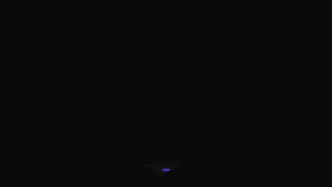

<h1 align="center">Hi 👋, I'm Sonika Kumar!</h1>
<h3 align="center">Keeping It (the code) Simple!</h3>

  

- 🚀 Full-Stack web development apprentice at Microverse.

- 💬 HTML, CSS, Bootstrap, and JavaScript enthusiast. Ready for tech talk!

- 📫 Reach me at sonikak004@gmail.com for exciting collaborations and opportunities.

<h3 align="left">Connect with me:</h3>

   

<h3 align="left">Languages and Tools:</h3>

        

# 📊 GitHub Stats:
 
 

### ✍️ Random Dev Quote

